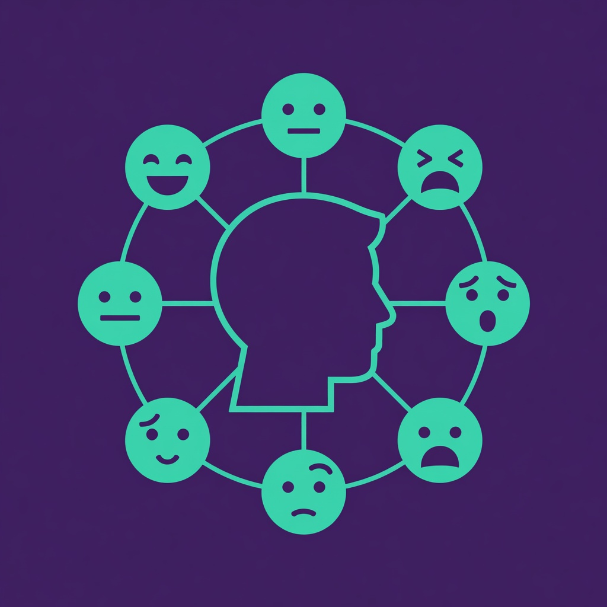

# AI Character Art Pipeline

**The hardest problem in AI game art is consistency.** This pipeline takes a single character reference image and produces a full character bible — expression sheets, turnaround views, action poses, and style-locked prompts — with zero manual tweaking.



Built for: **indie game devs**, **visual novel creators**, **children's book authors**

## Quick Start

```bash
# Install the skill
cp SKILL.md ~/.hermes/skills/ai-character-art-pipeline/
hermes skill load ai-character-art-pipeline

# Then in your agent chat:
"Run the AI Character Art Pipeline with this reference: [URL]"
```

## What It Produces

| Output | Description |
|---|---|
| **Expression Sheet** | 2×4 grid — 8 consistent expressions on one image |
| **Turnaround Sheet** | 5-angle sheet — front, 3/4, side, 3/4 back, rear |
| **Action Pose Sheet** | Any pose described — running, jumping, idle, casting |
| **Style Lock Prompts** | Reusable prompt templates that reproduce the character |
| **Character Bible** | Markdown doc with palette, notes, all prompts |

## How It Works

1. **Drop in one reference image** — any headshot or full-body render
2. **Pipeline generates outputs** using image-to-image AI
3. **Character Bible** is compiled automatically

The reference image anchors the character's features while only the expression/angle/pose changes. Results are consistent across unlimited generations.

## Requirements

- An agent framework that loads SKILL.md skills (Hermes, Claude Code, etc.)
- Image generation with image-to-image capability
- One character reference image

## License

MIT — commercial use allowed, modify freely.